<div class="MCWHeader1">
Internet of Things
</div>

<div class="MCWHeader2">
Hands-on lab step-by-step
</div>

<div class="MCWHeader3">
October 2021
</div>

Information in this document, including URL and other Internet Web site references, is subject to change without notice. Unless otherwise noted, the example companies, organizations, products, domain names, e-mail addresses, logos, people, places, and events depicted herein are fictitious, and no association with any real company, organization, product, domain name, e-mail address, logo, person, place or event is intended or should be inferred. Complying with all applicable copyright laws is the responsibility of the user. Without limiting the rights under copyright, no part of this document may be reproduced, stored in or introduced into a retrieval system, or transmitted in any form or by any means (electronic, mechanical, photocopying, recording, or otherwise), or for any purpose, without the express written permission of Microsoft Corporation.

Microsoft may have patents, patent applications, trademarks, copyrights, or other intellectual property rights covering subject matter in this document. Except as expressly provided in any written license agreement from Microsoft, the furnishing of this document does not give you any license to these patents, trademarks, copyrights, or other intellectual property.

The names of manufacturers, products, or URLs are provided for informational purposes only and Microsoft makes no representations and warranties, either expressed, implied, or statutory, regarding these manufacturers or the use of the products with any Microsoft technologies. The inclusion of a manufacturer or product does not imply endorsement of Microsoft of the manufacturer or product. Links may be provided to third party sites. Such sites are not under the control of Microsoft and Microsoft is not responsible for the contents of any linked site or any link contained in a linked site, or any changes or updates to such sites. Microsoft is not responsible for webcasting or any other form of transmission received from any linked site. Microsoft is providing these links to you only as a convenience, and the inclusion of any link does not imply endorsement of Microsoft of the site or the products contained therein.

© 2021 Microsoft Corporation. All rights reserved.

Microsoft and the trademarks listed at <https://www.microsoft.com/en-us/legal/intellectualproperty/Trademarks/Usage/General.aspx> are trademarks of the Microsoft group of companies. All other trademarks are property of their respective owners.

**Contents**

- [Internet of Things hands-on lab step-by-step](#internet-of-things-hands-on-lab-step-by-step)
  - [Abstract and learning objectives](#abstract-and-learning-objectives)
  - [Overview](#overview)
  - [Solution architecture](#solution-architecture)
  - [Requirements](#requirements)
  - [Exercise 1: IoT Hub and Device Provisioning Service deployment](#exercise-1-iot-hub-and-device-provisioning-service-deployment)
    - [Task 1: Provision the IoT Hub](#task-1-provision-the-iot-hub)
    - [Task 2: Deploy the Device Provisioning Service](#task-2-deploy-the-device-provisioning-service)
    - [Task 3: Link the IoT Hub to the Device Provisioning Service](#task-3-link-the-iot-hub-to-the-device-provisioning-service)
    - [Task 4: Create an enrollment group](#task-4-create-an-enrollment-group)
  - [Exercise 2: Completing the Smart Meter Simulator](#exercise-2-completing-the-smart-meter-simulator)
    - [Task 1: Implement device management with the IoT Hub](#task-1-implement-device-management-with-the-iot-hub)
    - [Task 2: Configure the DPS Group Enrollment Key and ID Scope](#task-2-configure-the-dps-group-enrollment-key-and-id-scope)
    - [Task 3: Implement the communication of telemetry with IoT Hub](#task-3-implement-the-communication-of-telemetry-with-iot-hub)
    - [Task 4: Verify device registration and telemetry](#task-4-verify-device-registration-and-telemetry)
  - [Exercise 3: Hot path data processing with Stream Analytics](#exercise-3-hot-path-data-processing-with-stream-analytics)
    - [Task 1: Create a Stream Analytics job for hot path processing to Power BI](#task-1-create-a-stream-analytics-job-for-hot-path-processing-to-power-bi)
    - [Task 2: Visualize hot data with Power BI](#task-2-visualize-hot-data-with-power-bi)
  - [Exercise 4: Cold path data processing with Azure Databricks](#exercise-4-cold-path-data-processing-with-azure-databricks)
    - [Task 1: Create a Storage account](#task-1-create-a-storage-account)
    - [Task 2: Create the Stream Analytics job for cold path processing](#task-2-create-the-stream-analytics-job-for-cold-path-processing)
    - [Task 3: Verify CSV files in blob storage](#task-3-verify-csv-files-in-blob-storage)
    - [Task 4: Process with Spark SQL](#task-4-process-with-spark-sql)
  - [Exercise 5: Sending commands to the IoT devices](#exercise-5-sending-commands-to-the-iot-devices)
    - [Task 1: Add your IoT Hub connection string to the CloudToDevice console app](#task-1-add-your-iot-hub-connection-string-to-the-cloudtodevice-console-app)
    - [Task 2: Send cloud-to-device messages](#task-2-send-cloud-to-device-messages)
  - [Exercise 6: Implement an IoT Edge Gateway](#exercise-6-implement-an-iot-edge-gateway)
    - [Task 1: Provision the IoT Edge device with the Azure IoT Hub Device Provisioning Service (DPS)](#task-1-provision-the-iot-edge-device-with-the-azure-iot-hub-device-provisioning-service-dps)
    - [Task 2: Deploy a Linux server as an IoT Edge device](#task-2-deploy-a-linux-server-as-an-iot-edge-device)
    - [Task 3: Generate test certificates for downstream device connectivity](#task-3-generate-test-certificates-for-downstream-device-connectivity)
    - [Task 4: Configure the IoT Edge Device as a Gateway in IoT Hub](#task-4-configure-the-iot-edge-device-as-a-gateway-in-iot-hub)
    - [Task 5: Update the device client to communicate through the IoT Edge Gateway](#task-5-update-the-device-client-to-communicate-through-the-iot-edge-gateway)
  - [After the hands-on lab](#after-the-hands-on-lab)
    - [Task 1: Delete the resource group](#task-1-delete-the-resource-group)

# Internet of Things hands-on lab step-by-step

If you have not yet completed the steps to set up your environment in [Before the hands-on lab setup guide](./Before%20the%20HOL%20-%20Internet%20of%20Things.md), you will need to do that before proceeding.

## Abstract and learning objectives

In this hands-on lab, you will construct an end-to-end IoT solution simulating high velocity data emitted from smart meters and analyzed in Azure. You will design a lambda architecture, filtering a subset of the telemetry data for real-time visualization on the hot path, and storing all the data in long-term storage for the cold path.

At the end of this hands-on lab, you will be better able to build an IoT solution implementing device registration with the IoT Hub Device Provisioning Service and visualizing hot data with Power BI.

## Overview

Fabrikam provides services and smart meters for enterprise energy (electrical power) management. Their **You-Left-The-Light-On** service enables the enterprise to understand their energy consumption.

## Solution architecture

Below is a diagram of the solution architecture you will build in this lab. Please study this carefully, so you understand the whole of the solution as you are working on the various components.


Smart Meters are installed in buildings. They will register with a Device Provisioning Service using an attestation method through an enrollment group. Once registered and connected, messages are ingested from the Smart Meters via the IoT Hub that the Device Provisioning Service assigned to the device. A Stream Analytics job pulls telemetry messages from IoT Hub and sends the messages to two different destinations. There are two Stream Analytics jobs, one that retrieves all messages and sends them to Blob Storage (the cold path), and another that selects out only the important events needed for reporting in real time (the hot path). Data entering the hot path will be reported on using Power BI visualizations and reports. For the cold path, Azure Databricks can be used to apply the batch computation needed for the reports at scale.

Other alternatives for processing of the ingested telemetry would be to use an HDInsight Storm cluster, a WebJob running the EventProcessorHost in place of Stream Analytics, or HDInsight running with Spark streaming. Depending on the type of message filtering being conducted for hot and cold stream separation, IoT Hub Message Routing might also be used, but this has the limitation that messages follow a single path, so with the current implementation, it would not be possible to send all messages to the cold path, while simultaneously sending some of the same messages into the hot path. An important limitation to keep in mind for Stream Analytics is that it is very restrictive on the format of the input data it can process: the payload must be UTF8 encoded JSON, UTF8 encoded CSV (fields delimited by commas, spaces, tabs, or vertical pipes), or AVRO, and it must be well-formed. If any devices transmitting telemetry cannot generate output in these formats (e.g., because they are legacy devices), or their output can be not well formed at times, then alternatives that can better deal with these situations should be investigated. Additionally, any custom code or logic cannot be embedded with Stream Analytics---if greater extensibility is required, the alternatives should be considered.

> **Note**: The preferred solution is only one of many possible, viable approaches.

## Requirements

- Microsoft Azure subscription must be pay-as-you-go or MSDN.
  - Trial subscriptions will not work.
- A virtual machine configured with:
  - Visual Studio Community 2019 or later
  - Azure SDK 2.9 or later (Included with Visual Studio)
- A running Azure Databricks cluster (see [Before the hands-on lab](./Before%20the%20HOL%20-%20Internet%20of%20Things.md))

## Exercise 1: IoT Hub and Device Provisioning Service deployment

Duration: 30 minutes

In your architecture design session with Fabrikam, it was agreed upon to use Azure Device Provisioning Service (DPS) to manage automatic device registration. The DPS would then assign an IoT Hub to the device that ingests telemetry from the Smart Meter Simulator. In this exercise, you will deploy an IoT Hub and DPS to enable device registration and connectivity.

### Task 1: Provision the IoT Hub

In these steps, you will provision an instance of IoT Hub.

1. In your browser, navigate to the [Azure portal](https://portal.azure.com), select **+Create a resource** in the navigation pane, enter `IoT Hub` into the **Search the Marketplace** box, and select **IoT Hub** from the results.

   

2. On the resource overview page, select **Create**.

3. On the **IoT Hub** screen, **Basics** tab, enter the following:

   - **Subscription**: Select the subscription you are using for this hands-on lab.

   - **Resource group**: Choose Use existing and select the **hands-on-lab-SUFFIX** resource group.

   - **Region**: Select the location you are using for this hands-on lab.

   - **IoT Hub Name**: Enter a unique name, such as `smartmeter-hub-SUFFIX`.

     

4. Select the **Management** tab. Accept the default Pricing and scale tier of **S1: Standard tier**, and select **Review + create**.

    

5. Once validation has passed, select **Create**.

6. When the IoT Hub deployment is completed, you will receive a notification in the Azure portal. Select **Go to resource** in the notification.

   

7. From the **IoT Hub's Overview** blade, select **Shared access policies** under **Settings** on the left-hand menu.

   

8. Select **iothubowner** policy.

   

9. In the **iothubowner** blade, select the **Copy** button to the right of the **Connection string - primary key** field. Record this value for a future task.

   

### Task 2: Deploy the Device Provisioning Service

In these steps, you will deploy an instance of the Device Provisioning Service (DPS).

1. In your browser, navigate to the [Azure portal](https://portal.azure.com), select **+Create a resource** in the navigation pane, enter `IOT Hub Device Provisioning Service` into the **Search the Marketplace** box, and select **IoT Hub** from the results.

    

2. On the resource overview page, select **Create**.

3. On the IoT Hub device provisioning service **Basics** tab, complete the form as follows:

   - **Subscription**: Select the subscription you are using for this hands-on lab.

   - **Resource group**: Choose Use existing and select the **hands-on-lab-SUFFIX** resource group.

   - **Name**: Enter a unique name, such as `smartmeter-dps-SUFFIX`.

   - **Region**: Select the location you are using for this hands-on lab.

    

4. Select **Review + create**, then once validation has passed, select **Create** once more to deploy the service.

5. When the DPS deployment is completed, select **Go to resource** on the deployment screen.

6. On the Overview screen of the Device Provisioning Service, copy and record the value for **ID Scope** for a future task.

    

### Task 3: Link the IoT Hub to the Device Provisioning Service

1. Remaining in the DPS resource, select **Linked IoT hubs** from the left menu, located beneath the **Settings** heading. Then select **+Add** from the toolbar.

    

2. In the Add link to IoT hub blade, populate the form as follows, then select **Save**:

   - **Subscription**: Select the subscription you are using for this hands-on lab.
   - **IoT Hub**: Select the `smartmeter-hub-{SUFFIX}` IoT Hub.
   - **Access Policy**: Select `iothubowner`.

    

### Task 4: Create an enrollment group

Creating an enrollment group enables Fabrikam to allow devices to self-register. This avoids the need to register each device manually. Group enrollments are made possible via secure Attestations, these could be via certificates or symmetric keys. In this example, we will use the symmetric key approach. Using symmetric keys should only be used in non-production scenarios, such as with this proof of concept.

1. Remaining in the DPS resource, select **Manage enrollments** from the left menu, then select **+Add enrollment group** from the toolbar menu.

    

2. In the Add Enrollment Group form, populate it as follows, then select the **Save** button.

    - **Group name**: Enter `smartmeter-device-group`.
    - **Attestation Type**: Select `Symmetric Key`.
    - **Auto-generate keys**: Checked.
    - **IoT Edge device**: Select `False`.
    - **Select how you want to assign devices to hubs**: Select `Evenly weighted distribution`.
    - **Select the IoT hubs this group can be assigned to**: Select `smartmeter-hub-{SUFFIX}.azure-devices.net`.
    - **Select how you want the device data to be handled on re-provisioning**: Select `Re-provision and migrate data`.
    - **Initial Device Twin State**: Retain the default value.
    - **Enable entry**: Select `Enable`.
  
   

3. Select the newly created enrollment group from the **Enrollment Groups** list.

4. On the Enrollment Group Details screen, copy the **Primary Key** value and record it for a future task.

    

## Exercise 2: Completing the Smart Meter Simulator

Duration: 60 minutes

Fabrikam has left you a partially completed sample in the form of the Smart Meter Simulator solution. You will need to complete the missing lines of code that deal with device registration management and device telemetry transmission that communicate with your IoT Hub.

### Task 1: Implement device management with the IoT Hub

1. In **Visual Studio** on your **Lab VM**, use **Solution Explorer** to open the file `DeviceManager.cs`.

2. From the Visual Studio **View** menu, choose **Task List**.

   

3. In the **Task List**, you will see a list of **TODO** tasks, where each task represents one line of code that needs to be completed. Complete the line of code below each **TODO** using the code below as a reference. If your task list is blank, complete TODO steps 1-5 as indicated in the code in the next step.

    >**Note**: Sometimes the Task List will not populate, this will not impact completing this lab.

4. The following code represents the completed tasks in **DeviceManager.cs**:

   ```csharp
    using System;
    using System.Security.Cryptography;
    using System.Text;
    using System.Threading.Tasks;
    using Microsoft.Azure.Devices.Provisioning.Client;
    using Microsoft.Azure.Devices.Provisioning.Client.Transport;
    using Microsoft.Azure.Devices.Shared;

    namespace SmartMeterSimulator
    {
        class DeviceManager
        {            
            /// <summary>
            /// Register a single device with the device provisioning service.
            /// </summary>
            /// <param name="enrollmentKey">Group Enrollment Key</param>
            /// <param name="idScope">DPS Service ID Scope</param>
            /// <param name="deviceId">Device Id of the device being registered</param>
            /// <returns></returns>
            public async static Task<SmartMeterDevice> RegisterDeviceAsync(string enrollmentKey, string idScope, string deviceId)
            {
                var globalEndpoint = "global.azure-devices-provisioning.net";
                SmartMeterDevice device = null;
                
                //TODO: 1. Derive a device key from a combination of the group enrollment key and the device id
                var primaryKey = ComputeDerivedSymmetricKey(enrollmentKey, deviceId);

                //TODO: 2. Create symmetric key with the generated primary key
                using (var security = new SecurityProviderSymmetricKey(deviceId, primaryKey, null))
                using (var transportHandler = new ProvisioningTransportHandlerMqtt())
                {
                    //TODO: 3. Create a Provisioning Device Client
                    var client = ProvisioningDeviceClient.Create(globalEndpoint, idScope, security, transportHandler);

                    //TODO: 4. Register the device using the symmetric key and MQTT
                    DeviceRegistrationResult result = await client.RegisterAsync();

                    //TODO: 5. Populate the device provisioning details
                    device = new SmartMeterDevice()
                    {
                        AuthenticationKey = primaryKey,
                        DeviceId = deviceId,
                        IoTHubHostName = result.AssignedHub
                    };
                }
                
                //return the device
                return device;
            }

            /// <summary>
            /// Compute a symmetric key for the provisioned device from the enrollment group symmetric key used in attestation.
            /// </summary>
            /// <param name="enrollmentKey">Enrollment group symmetric key.</param>
            /// <param name="deviceId">The device Id of the key to create.</param>
            /// <returns>The key for the specified device Id registration in the enrollment group.</returns>
            /// <seealso>
            /// https://docs.microsoft.com/en-us/azure/iot-edge/how-to-auto-provision-symmetric-keys?view=iotedge-2018-06#derive-a-device-key
            /// </seealso>
            private static string ComputeDerivedSymmetricKey(string enrollmentKey, string deviceId)
            {
                if (string.IsNullOrWhiteSpace(enrollmentKey))
                {
                    return enrollmentKey;
                }

                var key = "";
                using (var hmac = new HMACSHA256(Convert.FromBase64String(enrollmentKey)))
                {
                    key = Convert.ToBase64String(hmac.ComputeHash(Encoding.UTF8.GetBytes(deviceId)));
                }

                return key;
            }
        }

    }
   ```

   >**Note**:  Be sure you only replace code in the **DeviceManager** class and not any other code in the file.

5. Save **DeviceManager.cs**.

### Task 2: Configure the DPS Group Enrollment Key and ID Scope

You will want to avoid entering the DPS Group Enrollment Key and ID Scope every time the project is run. To do this, you can set this value as the default text for the `DPS Group Enrollment Primary Key` and `DPS ID Scope` text boxes in the application. Follow these steps to configure the connection string:

1. Return to the **SmartMeterSimulator** solution in **Visual Studio** on your **Lab VM**.

2. In the **Solution Explorer**, expand the **SmartMeterSimulator** project and double-click **MainForm.cs** to open it. (If the Solution Explorer is not in the upper-right corner of your Visual Studio instance, you can find it under the View menu in Visual Studio.)

   

    > **Note**: If the file does not open. One of the project files may be blocked.

   - Open **Windows Explorer** and navigate to the starter project folder: **C:\SmartMeter\Hands-on lab\lab-files\starter-project\SmartMeterSimulator**.
   - Right-click on the **MainForm.resx** file, then select **Properties**.
   - Check the **Unblock** checkbox on the bottom of the **General** tab, then select **Apply** then **OK**.

   

   - Close and reopen **Visual Studio**. Re-open the **MainForm.cs** file.

    >**Note**: If you are still unable to see the Windows Forms designer, close it, then right-click the project and select **Clean**. Then, right-click the project again and select **Build**. Now, you should be able to open the form without a problem.
    >
    >    
  
3. In the **Windows Forms designer surface**, select the **DPS Group Enrollment Primary Key** textbox.

   

4. In the **Properties** panel, scroll until you see the **Text** property. Paste your **DPS Enrollment Group Primary Key** value copied from Exercise 1, Task 4, Step 4 into the value for the **Text** property. (If the properties window is not visible below the Solution Explorer, right-click the TextBox, and select **Properties**.)

   

5. Repeat steps 3 and 4 to populate the **DPS ID Scope** textbox with the value you recorded in Exercise 1, Task 2, Step 6.

6. Your DPS Group Enrollment Primary Key and ID Scope should now be present every time you run the **Smart Meter Simulator**.

   

7. Save **MainForm.cs**.

### Task 3: Implement the communication of telemetry with IoT Hub

1. Open **Sensor.cs** from the **Solution Explorer**, and complete the **TODO** items 6 to 11 as indicated within the code that are responsible for transmitting telemetry data to the IoT Hub, as well as receiving data from IoT Hub.

2. The following code shows the completed result:

   ```csharp
    using System;
    using System.Text;
    using Microsoft.Azure.Devices.Client;
    using Newtonsoft.Json;


    namespace SmartMeterSimulator
    {
        /// <summary>
        /// A sensor represents a Smart Meter in the simulator.
        /// </summary>
        class Sensor
        {
            private DeviceClient DeviceClient;
            private string IotHubUri { get; set; }
            public string DeviceId { get; set; }
            public string DeviceKey { get; set; }
            public DeviceState State { get; set; }
            public string StatusWindow { get; set; }
            public string ReceivedMessage { get; set; }
            public double? ReceivedTemperatureSetting { get; set; }
            public double CurrentTemperature
            {
                get
                {
                    double avgTemperature = 70;
                    Random rand = new Random();
                    double currentTemperature = avgTemperature + rand.Next(-6, 6);

                    if (ReceivedTemperatureSetting.HasValue)
                    {
                        // If we received a cloud-to-device message that sets the temperature, override with the received value.
                        currentTemperature = ReceivedTemperatureSetting.Value;
                    }

                    if (currentTemperature <= 68)
                        TemperatureIndicator = SensorState.Cold;
                    else if (currentTemperature > 68 && currentTemperature < 72)
                        TemperatureIndicator = SensorState.Normal;
                    else if (currentTemperature >= 72)
                        TemperatureIndicator = SensorState.Hot;

                    return currentTemperature;
                }
            }
            public SensorState TemperatureIndicator { get; set; }

            public Sensor(string deviceId)
            {
                DeviceId = deviceId;

            }

            public void SetRegistrationInformation(string iotHubUri, string deviceKey)
            {
                IotHubUri = iotHubUri;
                DeviceKey = deviceKey;
                State = DeviceState.Registered;
            }
            public void InstallDevice(string statusWindow)
            {
                StatusWindow = statusWindow;
                State = DeviceState.Installed;
            }

            /// <summary>
            /// Connect a device to the IoT Hub by instantiating a DeviceClient for that Device by Id and Key.
            /// </summary>
            public void ConnectDevice()
            {
                //TODO: 6. Connect the Device to Iot Hub by creating an instance of DeviceClient
                DeviceClient = DeviceClient.Create(IotHubUri, new DeviceAuthenticationWithRegistrySymmetricKey(DeviceId, DeviceKey));

                //Set the Device State to Ready
                State = DeviceState.Connected;
            }

            public void DisconnectDevice()
            {
                //Delete the local device client            
                DeviceClient = null;

                //Set the Device State to Activate
                State = DeviceState.Registered;
            }

            /// <summary>
            /// Send a message to the IoT Hub from the Smart Meter device
            /// </summary>
            public async void SendMessageAsync()
            {
                var telemetryDataPoint = new
                {
                    id = DeviceId,
                    time = DateTime.UtcNow.ToString("o"),
                    temp = CurrentTemperature
                };

                //TODO: 7.Serialize the telemetryDataPoint to JSON
                var messageString = JsonConvert.SerializeObject(telemetryDataPoint);

                //TODO: 8.Encode the JSON string to ASCII as bytes and create new Message with the bytes
                var message = new Message(Encoding.ASCII.GetBytes(messageString));

                //TODO: 9.Send the message to the IoT Hub
                var sendEventAsync = DeviceClient?.SendEventAsync(message);
                if (sendEventAsync != null) await sendEventAsync;
            }

            /// <summary>
            /// Check for new messages sent to this device through IoT Hub.
            /// </summary>
            public async void ReceiveMessageAsync()
            {
                if (DeviceClient == null)
                    return;

                try
                {
                    Message receivedMessage = await DeviceClient?.ReceiveAsync();
                    if (receivedMessage == null)
                    {
                        ReceivedMessage = null;
                        return;
                    }

                    //TODO: 10.Set the received message for this sensor to the string value of the message byte array
                    ReceivedMessage = Encoding.ASCII.GetString(receivedMessage.GetBytes());
                    if (double.TryParse(ReceivedMessage, out var requestedTemperature))
                    {
                        ReceivedTemperatureSetting = requestedTemperature;
                    }
                    else
                    {
                        ReceivedTemperatureSetting = null;
                    }

                    // Send acknowledgement to IoT Hub that the has been successfully processed.
                    // The message can be safely removed from the device queue. If something happened
                    // that prevented the device app from completing the processing of the message,
                    // IoT Hub delivers it again.

                    //TODO: 11.Send acknowledgement to IoT hub that the message was processed
                    await DeviceClient?.CompleteAsync(receivedMessage);
                }
                catch (Exception)
                {
                    // The device client is null, likely due to it being disconnected since this method was called.
                    System.Diagnostics.Debug.WriteLine("The DeviceClient is null. This is likely due to it being disconnected since the ReceiveMessageAsync message was called.");
                }
            }
        }


        public enum DeviceState
        { 
            New,    
            Installed,
            Registered,         
            Connected,
            Transmit
        }
        public enum SensorState
        {
            Cold,
            Normal,
            Hot
        }
    }

   ```

    > **Note**:  Be sure you only replace the **Sensor** class and not any other code in the file.

3. Save **Sensor.cs**.

### Task 4: Verify device registration and telemetry

In this task, you will build and run the Smart Meter Simulator project.

1. In **Visual Studio** select **Build** from the Visual Studio menu, then select **Build Solution**.

2. Run the **Smart Meter Simulator**, by selecting the green **Start** button on the Visual Studio toolbar.

   

3. Select one or more of the windows within the building to simulate the installation of a smart meter device. Once selected, the window will turn yellow.

    

4. Select **Register** on the **Smart Meter Simulator** window, this triggers the smart meter automatic registration through the enrollment group. It will take a few seconds for each of the yellow (installed) windows to turn to cyan, indicating the device is registered.

   

5. At this point, you have installed and registered one or more devices (in cyan). To view this list of devices, you will switch over to the **Azure Portal**, and open the **IoT Hub** you provisioned.

6. From the **IoT Hub** blade, select **IoT Devices** under **Explorers** on the left-hand menu.

   

7. You should see the selected devices listed having a status of **Enabled**.

   

8. In the **Azure Portal**, open the Device Provisioning Service resource, then select **Manage enrollments** from the left menu. Select the **smartmeter-device-group** enrollment group.

    

9. In the Enrollment Group Details screen, select the **Registration Records** tab and notice the devices selected for registration in the simulator application are listed.

    

10. Return to the **Smart Meter Simulator** window.

11. Select **Connect**. Within a few moments, you should begin to see activity as the windows change color, indicating the smart meters are transmitting telemetry. The grid on the left will list each telemetry message transmitted and the simulated temperature value.

    

12. Allow the smart meter to continue to run for the duration of the lab.

## Exercise 3: Hot path data processing with Stream Analytics

Duration: 45 minutes

Fabrikam would like to visualize the "hot" data showing the average temperature reported by each device over a 5-minute window in Power BI.

### Task 1: Create a Stream Analytics job for hot path processing to Power BI

1. In the [Azure Portal](https://portal.azure.com), expand the left menu and select **+ Create a resource**, enter `stream analytics` into the **Search the Marketplace** box, select **Stream Analytics job** from the results, and select **Create**.

   

2. On the New Stream Analytics Job form, enter the following:

   - **Job name**: Enter `hot-stream`.
   - **Subscription**: Select the subscription you are using for this hands-on lab.
   - **Resource group**: Choose Use existing and select the **hands-on-lab-SUFFIX** resource group.
   - **Location**: Select the location you are using for resources in this hands-on lab.
   - **Hosting environment**: Select **Cloud**.
   - **Streaming units**: Change the value to `1` by sliding the slider all the way left.

     

3. Select **Create**.

4. Once provisioned, navigate to your new **Stream Analytics job** in the portal.

5. On the **Stream Analytics job** blade, select **Inputs** from the left-hand menu, under **Job Topology**, then select **+Add stream input**, and select **IoT Hub** from the dropdown menu to add an input connected to your IoT Hub.

   

6. On the **New Input** blade, enter the following:

   - **Input alias**: Enter `temps`.
   - Choose **Select IoT Hub from your subscriptions**.
   - **Subscription**: Select the subscription you are using for this hands-on lab.
   - **IoT Hub**: Select the **smartmeter-hub-SUFFIX** IoT Hub.
   - **Consumer Group**: Leave set to **\$Default**.
   - **Shared access policy name**: Select **service**.
   - **Endpoint**: Select **Messaging**.
   - **Partition Key**: Leave empty.
   - **Event serialization format**: Select **JSON**.
   - **Encoding**: Select **UTF-8**.
   - **Event compression type**: Leave set to **None**.

     

7. Select **Save**.

8. Next, select **Outputs** from the left-hand menu, under **Job Topology**, and select **+ Add**, then select **Power BI** from the drop-down menu.

   

9. In the **Power BI** blade, select **Authorize** to authorize the connection to your Power BI account. When prompted in the popup window, enter the account credentials you used to create your Power BI account in [Before the hands-on lab setup guide, Task 1](./Before%20the%20HOL%20-%20Internet%20of%20Things.md).

    

10. Once authorized, enter the following:

    - **Output alias**: Set to `powerbi`
    - **Group Workspace**: Select the default, **My workspace**.
    - **Authentication mode**: Select **User token**.
    - **Dataset Name**: Enter `avgtemps`
    - **Table Name**: Enter `avgtemps`

    

11. Select **Save**.

12. Next, select **Query** from the left-hand menu, under **Job Topology**.

    

13. In the **Query** text box, paste the following query.

    ```sql
    SELECT AVG(temp) AS Average, id
    INTO powerbi
    FROM temps
    GROUP BY TumblingWindow(minute, 5), id
    ```

14. Select **Save query**.

    

15. Return to the **Overview** blade on your **Stream Analytics job** and select **Start**.

    

16. In the **Start job** blade, select **Now** (the job will start processing messages from the current point in time onward).

    

17. Select **Start**.

18. Allow your Stream Analytics Job a few minutes to start.

19. Once the Stream Analytics Job has successfully started, verify that you are showing a non-zero amount of **Input Events** on the **Monitoring** chart on the **Overview** blade. You may need to reconnect your devices on the **Smart Meter Simulator** and let it run for a while to see the events.

    

### Task 2: Visualize hot data with Power BI

1. Sign into your Power BI subscription (<https://app.powerbi.com>) to see if data is being collected.

2. Select **My Workspace** on the left-hand menu, then select the **Datasets + dataflows tab**, and locate the **avgtemps** dataset from the list.

   > **Note:** Sometimes it takes few minutes for the dataset to appear in the Power BI Dataset tab under **My Workspace**

   

3. Select the **Create Report** button under the **Actions** menu.

   

4. On the **Visualizations** palette, select **Stacked column chart** to create a chart visualization.

   

5. In the **Fields** listing, drag the **id** field, and drop it into the **Axis** field.

   

6. Next, drag the **Average** field and drop it into the **Values** field.

   

7. Now, set the **Values** to **Max of average**, by selecting the down arrow next to **Average**, and select **Maximum**.

   

8. Repeat steps 4-7, this time adding a Stacked Column Chart for **Min of average**. (You may need to select on any area of white space on the report designer surface to deselect the Max of average by id chart visualization.)

   

9. Next, add a **table visualization**.

   

10. Set the values to **id** and **Average of Average**, by dragging and dropping both fields in the **Values** field, then selecting the dropdown next to **Average**, and selecting **Average**.

    

11. Under the **File** menu, select to **Save** the report.

    

12. Enter the name `Average Temperatures`, and select **Save**.

    

13. Within the report, select one of the columns to see the data for just that device.

    

## Exercise 4: Cold path data processing with Azure Databricks

Duration: 60 minutes

Fabrikam would like to be able to capture all the "cold" data into scalable storage so that they can summarize it periodically using a Spark SQL query.

### Task 1: Create a Storage account

1. In the [Azure portal](https://portal.azure.com), select **+ Create a resource**, enter `storage account` into the **Search the Marketplace** box, select **Storage account** from the results, and select **Create**.

   

2. In the **Create storage account** on the **Basics** tab, enter the following:

   - **Subscription**: Select the subscription you are using for this hands-on lab.
   - **Resource group**: Choose Use existing and select the **hands-on-lab-SUFFIX** resource group.
   - **Storage account name**: Enter `smartmetersSUFFIX`.
   - **Location**: Select the location you are using for resources in this hands-on lab.
   - **Performance**: Select **Standard**.
   - **Redundancy**: Select **Locally-redundant storage (LRS)**.

   

3. Select the **Advanced** tab, verify the following:

   - **Require secure transfer for REST API operations**: Unchecked.

   

4. Select **Review + create**.

5. Once validation has passed, select **Create**.

6. Once provisioned, navigate to your storage account, select **Access keys** from the left-hand menu, select **Show keys** from the top toolbar, then copy the **key1** Key value into a text editor, such as Notepad, for later use.

   

### Task 2: Create the Stream Analytics job for cold path processing

To capture all metrics for the cold path, set up another Stream Analytics job that will write all events to Blob storage for analysis with Azure Databricks.

1. In the [Azure Portal](https://portal.azure.com), select **+ Create a resource**, enter `stream analytics job` into the **Search the Marketplace** box, select **Stream Analytics job** from the results, and select **Create**.

   

2. On the New Stream Analytics Job blade, enter the following:

   - **Job name**: Enter `cold-stream`.
   - **Subscription**: Select the subscription you are using for this hands-on lab.
   - **Resource group**: Select the **hands-on-lab-SUFFIX** resource group.
   - **Location**: Select the location you are using for resources in this hands-on lab.
   - **Hosting environment**: Select **Cloud**.
   - **Streaming units**: Drag the slider all the way to the left to select `1` streaming unit.

     

3. Select **Create**.

4. Once provisioned, navigate to your new **Stream Analytics job** in the portal.

5. On the **Stream Analytics job** blade, select **Inputs** from the left-hand menu, under **Job Topology**, then select **+Add stream input**, and select **IoT Hub** from the dropdown menu to add an input connected to your IoT Hub.

   

6. On the **New Input** blade, enter the following:

   - **Input alias**: Enter `iothub`.
   - Choose **Select IoT Hub from your subscriptions**.
   - **Subscription**: Select the subscription you are using for this hands-on lab.
   - **IoT Hub**: Select the **smartmeter-hub-SUFFIX** IoT Hub.
   - **Consumer Group**: Leave set to **\$Default**.
   - **Shared access policy name**: Select **service**.
   - **Endpoint**: Select **Messaging**.
   - **Partition key**: Keep empty.
   - **Event serialization format**: Select **JSON**.
   - **Encoding**: Select **UTF-8**.
   - **Event compression type**: Leave set to **None**.

     

7. Select **Save**.

8. Next, select **Outputs** from the left-hand menu, under **Job Topology**, and select **+ Add**, then select **Blob storage/ADLS Gen2** from the drop-down menu.

   

9. On the **Blob storage** output blade, enter the following:

   - **Output alias**: Set to `blobs`.
   - Choose **Select blob storage from your subscriptions**.
   - **Subscription**: Select the subscription you are using for this hands-on lab.
   - **Storage account**: Select the **smartmetersSUFFIX** storage account you created in the previous task.
   - **Container**: Choose **Create new** and enter `smartmeters`
   - **Authentication mode**: Select **Connection string**.
   - **Path pattern**: Enter `smartmeters/{date}/{time}`
   - **Date format**: Select **YYYY-DD-MM**.
   - **Time format**: Select **HH**.
   - **Event serialization format**: Select **CSV**, **comma (,)**
   - **Encoding**: Select **UTF-8**.
   - **Minimum rows**: Enter **100**.
   - **Maximum time**: Enter **5** Minutes.

     

     Select **Save**.

10. Next, select **Query** from the left-hand menu, under **Job Topology**.

    

11. In the **Query** text box, paste the following query.

    ```sql
    SELECT
          *
    INTO
          blobs
    FROM
          iothub
    ```

12. Select **Save query**, and **Yes** when prompted with the confirmation.

    

13. Return to the **Overview** blade on your **Stream Analytics job** and select **Start**.

    

14. In the **Start job** blade, select **Now** (the job will start processing messages from the current point in time onward).

    

15. Select **Start**.

16. Allow your Stream Analytics Job a few minutes to start.

17. Once the Stream Analytics Job has successfully started, verify that you are showing a non-zero amount of **Input Events** on the **Monitoring** chart on the **Overview** blade. You may need to reconnect your devices on the **Smart Meter Simulator** and let it run for a while to see the events.

    

### Task 3: Verify CSV files in blob storage

In this task, we are going to verify that the CSV file is being written to blob storage.

> **Note**: This can be done via Visual Studio or using the Azure portal. For this lab, we will perform the task using Visual Studio.

1. Within **Visual Studio** on your **Lab VM**, select the **View** menu, then select **Cloud Explorer**.

   

2. In **Cloud Explorer**, select **Account Management**, and connect to your Microsoft Azure Subscription.

   

3. If prompted, sign into your Azure account.

4. Allow Cloud Explorer about 30 seconds to load your subscription resources.

5. Expand your **Azure subscription**, then expand **Storage Accounts**, expand the **smartmetersSUFFIX** storage account, then expand the **Blob containers** node, then right-click the **smartmeters** container, and select **Open**. It may take a few moments to load your storage accounts.

   

6. Verify files are being written to Blob storage (the files should be located underneath the **smartmeters** container).

   

### Task 4: Process with Spark SQL

In this task, you will create a new Databricks notebook to perform some processing and visualization of the cold path data using Spark.

> **Note**: The complete Databricks notebook can be found in the Databricks-notebook folder of the GitHub repo associated with this hands-on lab, should you need to reference it for troubleshooting.

1. In the [Azure portal](https://portal.azure.com), navigate to the **Azure Databricks** resource you created in the [Before the hands-on lab setup guide](./Before%20the%20HOL%20-%20Internet%20of%20Things.md) exercises, and select **Launch Workspace**.

   

2. On the **Azure Databricks** landing page, create a new notebook by selecting **New Notebook** under **Common Tasks**.

    

3. In the **Create Notebook** dialog, enter `smartmeters` as the **Name** and select **Python** as the **Language**, then select **Create**.

   

    > **Note**: If your cluster is stopped, you can select the down arrow next to your attached cluster name, and select Start Cluster from the menu, then select Confirm when prompted.

4. In the **first cell** of your **Databricks notebook** (referred to as a paragraph in notebook jargon), enter the following **Python code** that creates widgets in the notebook for entering your **Azure storage account name** and **key**.

   ```python
   # Create widgets for storage account name and key
   dbutils.widgets.text("accountName", "", "Account Name")
   dbutils.widgets.text("accountKey", "", "Account Key")
   ```

    > **Note**:  Make sure to be aware of any indents\tabs. Python  treats indents\tabs with specific syntactical meaning.

5. Now, select the **Run** button on the right side of the cell and select **Run cell**.

   

6. When the cell finishes executing, you will see the **Account Key** and **Account Name** widgets appear at the top of the notebook, just below the toolbar.

   

7. You will also notice a message at the bottom of the cell, indicating that the cell execution completed, and the amount of time it took.

   

8. Enter your **Azure Storage account key** into the **Account Key widget text box**, and your **Azure storage account name** into the **Account Name widget text box**. These values can be obtained from the **Access keys** blade in your storage account.

    

9. At the bottom of the **first cell**, select the **+** button to insert a new cell below it.

    

10. In the **new cell**, paste the following code that will assign the values you entered into the widgets you created above into variables that will be used throughout the notebook.

    ```python
    # Get values entered into widgets
    accountName = dbutils.widgets.get("accountName")
    accountKey = dbutils.widgets.get("accountKey")
    ```

11. Run the cell.

12. **Insert a new cell** into the notebook, and paste the following code to mount your blob storage account into Databricks File System (DBFS), then **run** the cell.

    ```python
    # Mount the blob storage account at /mnt/smartmeters. This assumes your container name is smartmeters, and you have a folder named smartmeters within that container, as specified in the exercises above.
    if not any(mount.mountPoint == '/mnt/smartmeters' for mount in dbutils.fs.mounts()): 
      dbutils.fs.mount(
      source = "wasbs://smartmeters@" + accountName + ".blob.core.windows.net/smartmeters",
      mount_point = "/mnt/smartmeters",
      extra_configs = {"fs.azure.account.key." + accountName + ".blob.core.windows.net": accountKey})
    ```

    > **Note**: Mounting Azure Blob storage directly to DBFS allows you to access files as if they were on the local file system. Once your blob storage account is mounted, you can access them with Databricks Utilities, `dbutils.fs` commands.

13. **Insert a new cell** and paste the code below to see how **dbutils.fs.ls** can be used to list the files and folders directly below the **smartmeters** folder.

    ```python
    # Inspect the file structure
    display(dbutils.fs.ls("/mnt/smartmeters/"))
    ```

14. **Run** the cell.

15. You know from inspecting the files in the storage container that the files are contained within a folder structure resembling, **smartmeters/YYYY-DD-MM/HH**. You can use wildcards to obfuscate the date and hour folders, as well as the file names, and access all the files in all the folders. **Insert another cell** into the notebook, paste the following code, and **run** the cell to load the data from the files in blob storage into a **Databricks Dataframe**.

    ```python
    # Create a Dataframe containing data from all the files in blob storage, regardless of the folder they are located within.
    df = spark.read.options(header='true', inferSchema='true').csv("dbfs:/mnt/smartmeters/*/*/*.csv",header=True)
    print(df.dtypes)
    ```

    > **Note**: In some rare cases, you may receive an error that the **dbfs:/mnt/smartmeters/\*/\*/\*.csv** path is incorrect. If this happens, change the path in the cell to the following: **dbfs:/mnt/smartmeters/\*/\*/\*/\*/\*.csv**

16. The cell above also outputs the value of the **df.dtypes** property, which is a list of the data types of the columns added to the **Dataframe**, similar to the following:

    

    >**Note**: Do not worry if any of the time columns in the output are represented as `string`s, rather than `timestamp`s. It is simple to perform this cast if you need to. 

17. **Insert another cell** and run the following code to view the first 10 records contained in the **Dataframe**.

    ```python
    df.show(10)
    ```

18. Now, you can save the **Dataframe** to a **global table** in **Databricks**. This will make the table accessible to all users and clusters in your Databricks workspace. **Insert a new cell** and **run** the following code.

    ```python
    df.write.mode("overwrite").saveAsTable("SmartMeters")
    ```

19. Now, you will use the `%sql` magic command to change the language of the next cell to **SQL** from the notebook's default language, Python, then execute a SQL command to aggregate the SmartMeter data by average temperature. Paste the following code into **a new cell**, and **run** the cell.

    ```sql
    %sql
    SELECT id, COUNT(*) AS count, AVG(temp) AS averageTemp FROM SmartMeters GROUP BY id ORDER BY id
    ```

20. The output from the SQL command should resemble the following table:

    

21. Now, execute the same command in **a new cell**, this time using **Spark SQL** so you can save the summary data into a Dataframe. Copy and **execute** the following code into **a new cell**:

    ```python
    # Query the table to create a Dataframe containing the summary
    summary = spark.sql("SELECT id, COUNT(*) AS count, AVG(temp) AS averageTemp FROM SmartMeters GROUP BY id ORDER BY id")

    # Save the new pre-computed table
    summary.write.mode("overwrite").saveAsTable("DeviceSummary")
    ```

22. Next, query from this summary table by **executing** the following query in **a new cell**:

    ```sql
    %sql
    SELECT * FROM DeviceSummary
    ```

23. **Below** the results table, notice the area to change the visualization for the tabular output. Expand the **Chart** menu and choose the **Bar** option.

    

24. With the Bar chart visualization chosen, a **Plot Options..** button appears. Select **Plot Options..** and in the **Customize Plot** dialog, ensure the following are set:

    - **Keys**: **id**
    - **Values**: **averageTemp**
    - **Aggregation**: Select **AVG**.
    - Select **Grouped** as the chart type.
    - **Display type**: Select **Bar chart**.

      

25. Select **Apply**.

26. Observe the results graphed as a column chart, where each column represents a device's average temperature.

    

## Exercise 5: Sending commands to the IoT devices

Duration: 20 minutes

Fabrikam would like to send commands to devices from the cloud in order to control their behavior. In this exercise, you will send commands that control the temperature settings of individual devices.

### Task 1: Add your IoT Hub connection string to the CloudToDevice console app

This console app is configured to connect to IoT Hub using the same connection string you use in the SmartMeterSimulator app. Messages are sent from the console app to IoT Hub, specifying a device by its ID, for example **Device1**. IoT Hub then transmits that message to the device when it is connected. This is called a **cloud-to-device message**. The console app is not directly connecting to the device and sending it the message. All messages flow through IoT Hub where the connections and device state are managed.

1. Return to the **SmartMeterSimulator** solution in **Visual Studio** on your **Lab VM**.

2. In the **Solution Explorer**, expand the **CloudToDevice** project and open **Program.cs**. (If the Solution Explorer is not in the upper-right corner of your Visual Studio instance, you can find it under the View menu in Visual Studio.)

    

3. Replace **YOUR-CONNECTION-STRING** on line 13 with your IoT Hub connection string. This is the same string you added to the Main form in the SmartMeterSimulator earlier. The line you need to update looks like this:

    ```csharp
    static string connectionString = "YOUR-CONNECTION-STRING";
    ```

    After updating, your **Program.cs** file should look similar to the following:

    

4. Save the file.

### Task 2: Send cloud-to-device messages

In this task, you will leave the simulator running and separately launch the console app to start sending cloud-to-device messages.

1. If you hover over one of the windows, you will see a dialog display information about the associated device, including the Device ID (in this case, **Device0**), Device Key, Temperature, and Indicator. The legend on the bottom shows the indicator displayed for each temperature range. The Device ID is important when sending cloud-to-device messages, as this is how we will target a specific device when we remotely set the desired temperature. Keep the Device ID values in mind when sending the messages in the next task.

    

2. Within the **SmartMeterSimulator** Visual Studio solution, right-click the **CloudToDevice** project, select **Debug**, then select **Start new instance** to run the console app.

3. In the **console window**, enter a **device number** when prompted. Accepted values are 0-9, since there are 10 devices whose IDs begin with 0. You can hover over the windows in the **Smart Meter Simulator** to view the Device IDs. When you enter a number, such as `0`, then a message will be sent to **Device0**. Be certain to select the device number of a registered window!

    

4. Now enter a **temperature value** between 65 and 85 degrees (F) when prompted. If you set a value above 72 degrees, the window will turn red. If the value is set between 68 and 72 degrees, it will turn green. Values below 68 degrees will turn the window blue. Once you set a value, the device will remain at that value until you set a new value, rather than randomly changing.

    

    If you run the **Smart Meter Simulator** side-by-side with the **console app**, you can observe the message logged by the Smart Meter Simulator within seconds. This message appears with a yellow background and displays the temperature request value sent to the device. In our case, we sent a request of 70 degrees to Device0. The console app indicates that it is sending the temperature request to the indicated device.

5. Hover over the device to which you sent the message. You will see that its temperature is set to the value you requested through the console app.

    

6. In the console window, you can enter `Y` to send another message. Experiment with setting the temperature on other devices and observe the results.

## Exercise 6: Implement an IoT Edge Gateway

Duration: 80 minutes

An IoT Edge Gateway device provides a connection between other devices on the network and the IoT Hub. Edge Gateway devices can be classified as a transparent or translation gateway.

In a transparent gateway scenario, the IoT Edge hub module itself acts as IoT Hub, it handles connections from other devices that have an identity with the same IoT hub. This type of gateway pattern is called transparent because messages pass from downstream devices to the IoT Hub as though there were not a gateway between them.

A translation gateway provides a connection to the IoT hub for devices that don't or can't connect to IoT Hub on their own, such as with devices that communicate over Bluetooth or Zigbee. This type of gateway pattern is called translation because the IoT Edge device has to perform processing on incoming device messages before they can be forwarded to the IoT Hub. These scenarios require additional modules on the IoT Edge gateway to handle the messaging protocol translation..

The transparent and translation gateway patterns are not mutually exclusive. A single IoT Edge device can function as both a transparent gateway and a translation gateway.

In one customer building, Fabrikam would like to establish a transparent IoT Edge Gateway to provide downstream device isolation and to deal with isolated internet outages. In this scenario, all communication from the building's IoT devices will be sent to IoT Hub via the gateway device, and when there is no internet connection, all telemetry will be held by the gateway device until connectivity is restored.

In this exercise, you will establish the LabVM as an IoT Edge transparent gateway and configure IoT devices to communicate through the gateway.

### Task 1: Provision the IoT Edge device with the Azure IoT Hub Device Provisioning Service (DPS)

Earlier in the lab we provisioned smart meter devices at scale using an enrollment group with the Azure IoT Hub Device Provisioning Service (DPS). In this task, we will provision LabVM as an IoT Edge device using an individual enrollment. We will continue to use symmetric key attestation.

>**Note**: Device attestation using a TPM or X.509 certificates is more secure, and should be used for more stringent security requirements in production environments.

1. In the Azure Portal, open the lab resource group and select the **smartmeter-dps-{suffix}** device provisioning service resource.

2. From the left menu of the DPS, select **Manage enrollments**. Then, from the toolbar menu, select **+ Add individual enrollment**.

    

3. In the **Add Enrollment** form, populate the following values (leaving the rest as their defaults), then press **Save**.

    | Field | Value |
    |-------|-------|
    | Mechanism | Select **Symmetric Key**. |
    | Registration ID | Enter `edge-vm-{SUFFIX}`. |
    | IoT Edge device | Select **True** |

    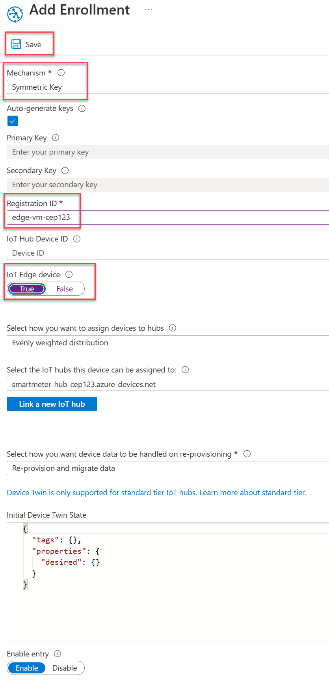

4. On the **Manage enrollments** screen, select the **Individual Enrollments** tab, then select the **edge-vm-{SUFFIX}** registration entry.

    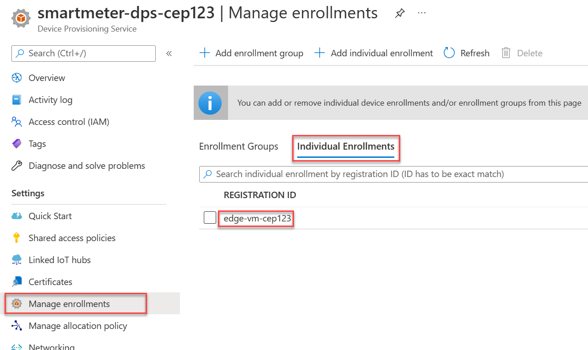

5. On the edge-vm-{SUFFIX} Enrollment Details screen, copy and record the Primary Key value to a text editor.

    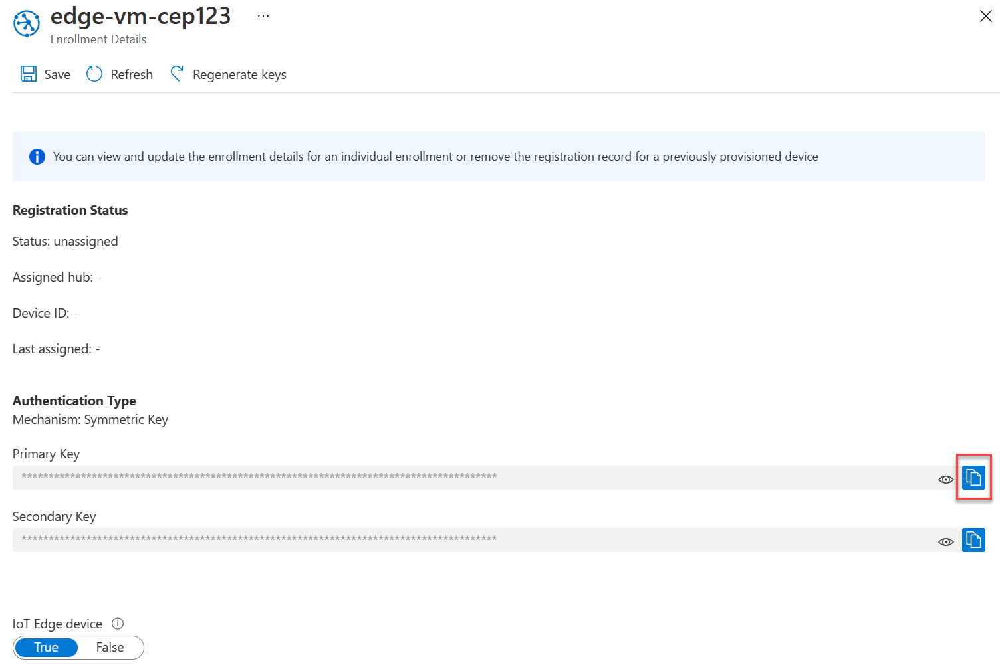

### Task 2: Deploy a Linux server as an IoT Edge device

The IoT Edge runtime can be installed on various form factors, from small development boards like the Raspberry Pi to industrial-sized servers. Fabrikam desires to deploy a Linux Virtual Machine to serve as the IoT Edge Gateway device.

1. In the Azure Portal, open the lab resource group and select **+ Create** from the toolbar menu.

2. In the Search services and marketplace text box, enter and select `Ubuntu Server 18.04 LTS` from the suggestion list. Then on the resource screen, select **Create**.

3. In the **Create a virtual machine** blade, fill the form as follows then select **Review + create**. Fields that are not specified can retain their default values.

    | Field | Value |
    |-------|-------|
    | Virtual machine name | Enter `edge-vm-{SUFFIX}`. |
    | Authentication type | Select **Password**. |
    | Username | Enter `demouser`. |
    | Password | Enter `Password.1!!`. |
    | Confirm password | Enter `Password.1!!`.|

    

4. Once deployment has completed, open the newly deployed **edge-vm-{SUFFIX}** resource and record the Public IP address value in a text editor.

    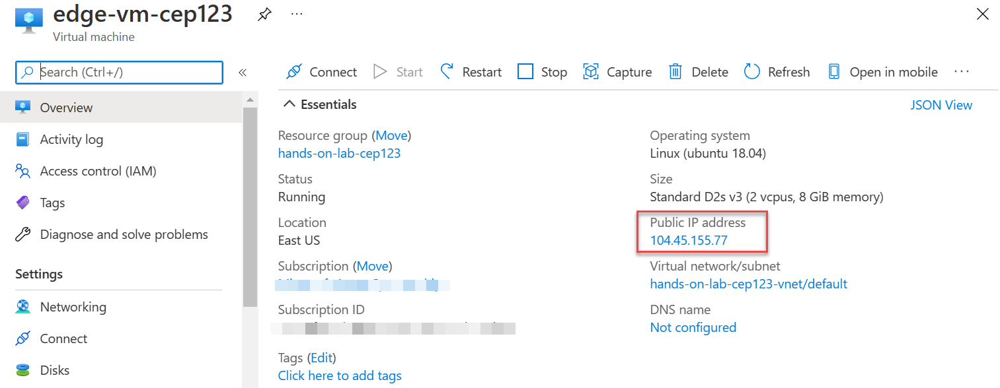

5. To setup a host name for the IoT Edge device, select the **Not configured** link next to the **DNS name** field.

    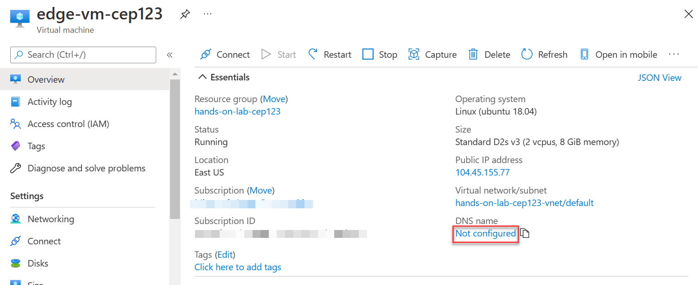

6. On the **edge-vm-{SUFFIX}-ip** Configuration screen, provide the DNS name label **edge-vm-{SUFFIX}**. It is important that this value matches the registration ID of the device in DPS. Select **Save**.

    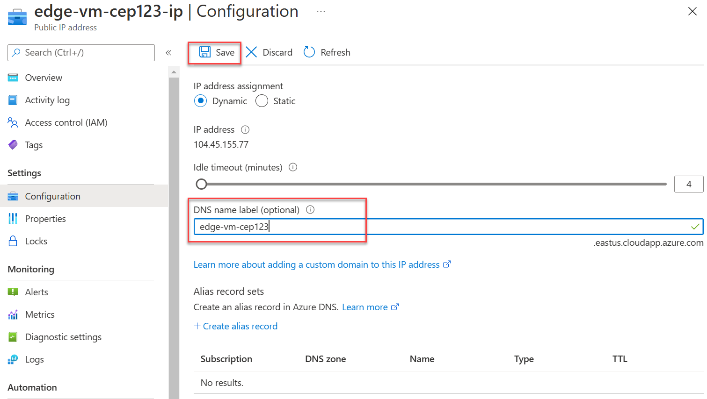

7. Wait a few moments, then return to the **edge-vm-{SUFFIX}** Overview screen and select **Refresh** from the toolbar menu. The DNS name value should now be populated with the label you assigned in the previous step.

   

8. In the upper right menu of the Azure Portal, open a cloud shell instance selecting **Bash** as the language of choice.

    

9. In the cloud shell, we will SSH into the virtual machine using the IP you recorded. At the Bash prompt, execute the following command, replacing {ipAddress} with the appropriate value.

    ```Bash
    ssh demouser@{ipAddress}
    ```

10. If prompted to trust the fingerprint, enter `yes`.

11. When prompted for a password, enter `Password.1!!`.

12. You are now connected to the virtual machine, you can tell by the prompt changing to **demouser@edge-vm-{SUFFIX}**. All commands executed will now be run on the virtual machine.

    

13. Install the Microsoft installation packages repository configuration by executing the following.

    ```Bash
    curl https://packages.microsoft.com/config/ubuntu/18.04/multiarch/prod.list > ./microsoft-prod.list
    ```

14. Copy the generated list to the sources.list.d directory by issuing the following command.

    ```Bash
    sudo cp ./microsoft-prod.list /etc/apt/sources.list.d/
    ```

15. Install the Microsoft GPG public key.

    ```Bash
    curl https://packages.microsoft.com/keys/microsoft.asc | gpg --dearmor > microsoft.gpg
    ```

16. Copy the key to the trusted location by executing the following command.

    ```Bash
    sudo cp ./microsoft.gpg /etc/apt/trusted.gpg.d/
    ```

17. Now that the Microsoft package feed has been added and trusted, update the device package list by executing the following command.

    ```Bash
    sudo apt-get update
    ```

18. Install the moby container engine by issuing the following command. When prompted to continue, enter `Y`. This container engine will be used to run IoT Edge modules in the form of Docker containers.

    ```Bash
    sudo apt-get install moby-engine
    ```

19. Install the IoT Edge runtime by executing the following command. When prompted to continue, enter `y`.

    ```Bash
    sudo apt-get install aziot-edge
    ```

20. Create a configuration file from a template that will contain the device identity and Device Provisioning Service information by executing the following command.

    ```Bash
    sudo cp /etc/aziot/config.toml.edge.template /etc/aziot/config.toml
    ```

21. Edit the newly created configuration file by issuing the following command.

    ```Bash
    sudo nano /etc/aziot/config.toml
    ```

22. Using the arrow keys on the keyboard, locate and uncomment the **hostname** variable. Set its value to the host name you assigned to edge-vm.

    

23. Keeping the configuration file open in nano, find the location of the DPS provisioning with symmetric key section. Uncomment and modify the id_scope, registration id (edge-vm), and symmetric_key (individual device enrollment primary key) values, then exit with saving the file (Ctrl+X, then Y, then press enter).

    

24. Apply the configuration changes by executing the following command.

    ```Bash
    sudo iotedge config apply
    ```

25. Verify the installation by checking the status of the IoT Edge service.

    ```Bash
    sudo iotedge system status
    ```

26. Discover installed IoT Edge modules. The **edgeAgent** module should be listed with a status of **running**.

    ```Bash
    sudo iotedge list
    ```

    

27. In the Azure Portal, open the lab resource group and select the **smartmeter-hub-{SUFFIX}** IoT Hub. Verify the IoT Edge device successfully registered through the DPS by selecting **IoT Edge** from the left menu and finding **edge-vm-{SUFFIX}** in the listing.

    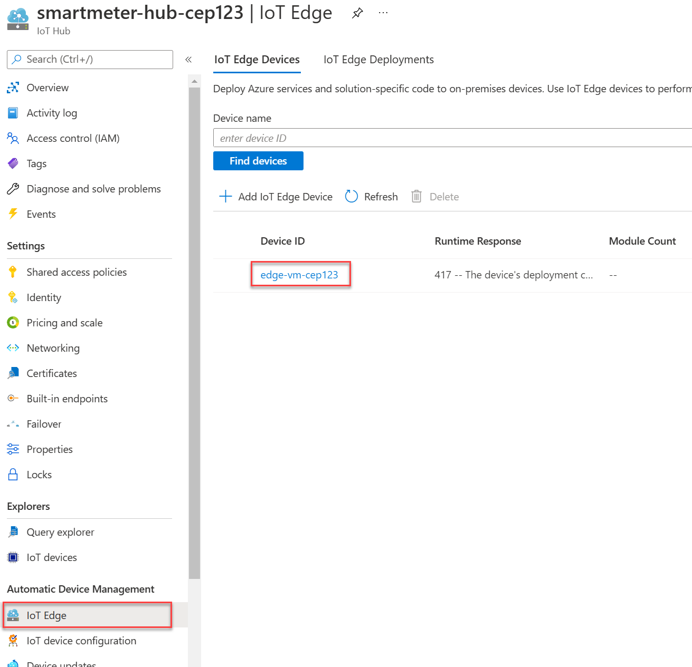

28. In order for downstream devices to communicate with the IoT Edge Gateway using the AMQP protocol, port 5671 needs to be opened in the Ubuntu firewall. Open port 5671 by executing the following command in the cloud shell.

    ```Bash
    sudo ufw allow 5671
    ```

29. Keep the cloud shell window open and connected to the edge-vm via ssh for the next task.

30. In the Azure Portal, open the lab resource group and select the **edge-vm-{SUFFIX}-nsg** Network security group.

31. From the left menu, select **Inbound security rules**, then **+ Add**.

    

32. In the **Add inbound security rule** blade, fill the form as follows and select **Add**. Fields not mentioned retain their default value.

    | Field | Value |
    |-------|-------|
    | Destination port ranges | Enter `5671`. |
    | Name | Enter `AMQP`. |

    

### Task 3: Generate test certificates for downstream device connectivity

It is a requirement that downstream devices authenticate to the [IoT Edge Gateway using certificates](https://docs.microsoft.com/en-us/azure/iot-edge/how-to-create-transparent-gateway). In this task, you will create test certificates and ensure proper authentication between downstream devices and the gateway device.

1. The Azure/iotedge GitHub project contains scripts to generate non-production certificates. Clone the repository by executing the following command:

   ```Bash
   git clone https://github.com/Azure/iotedge.git
   ```

2. Create a directory to hold the necessary certificates.

    ```Bash
    mkdir certificates
    ```

3. Move to the new directory.

    ```Bash
    cd certificates
    ```

4. Copy the necessary scripts from the GitHub repository.

    ```Bash
    cp ../iotedge/tools/CACertificates/*.cnf .
    ```

    then

    ```Bash
    cp ../iotedge/tools/CACertificates/certGen.sh .
    ```

5. Leverage the helper script to generate the root CA certificate and one intermediate certificate.

   ```Bash
   ./certGen.sh create_root_and_intermediate
   ```

6. Leverage the helper script to create the IoT Edge device CA certificate.

   ```Bash
   ./certGen.sh create_edge_device_ca_certificate "edgevmca"
   ```

7. Once more we will edit the IoT Edge configuration to configure the generated certificates.

    ```Bash
    sudo nano /etc/aziot/config.toml
    ```

8. Locate the **trust_bundle_cert** parameter, uncomment and set the value as follows.

    ```Bash
    trust_bundle_cert = "file:///home/demouser/certificates/certs/azure-iot-test-only.root.ca.cert.pem"
    ```

9. Continuing in the same file, locate the **\[edge_ca\]** section, uncomment and replace the values as follows, then save and exit while saving the file (Ctrl+X, then Y, then press enter):

    ```Bash
    [edge_ca]
    cert: "file:///home/demouser/certificates/certs/iot-edge-device-ca-edgevmca-full-chain.cert.pem"
    pk: "file:///home/demouser/certificates/private/iot-edge-device-ca-edgevmca.key.pem"
    ```

10. Apply the configuration changes by executing the following command.

    ```Bash
    sudo iotedge config apply
    ```

11. Exit the SSH session by executing the following command:

    ```Bash
    exit
    ```

12. Next, create a **certificates** directory and download the IoT Edge certificates to the cloud shell storage.

    ```Bash
    mkdir ~/certificates
    ```

    Followed by the secure copy command (replacing {edgeVMIp} with the IP address of the IoT Edge device):

    ```Bash
     scp -r -p demouser@{edgeVmIp}:~/certificates ~/certificates
    ```

    You will be prompted for the password: `Password.1!!`.

13. Download the root certificate to a known location by selecting the **Upload/Download files** button on the cloud shell toolbar menu, and choosing **Download** from the expanded menu options.

    

14. In the **Download a file** dialog, set the path to the following value, this will download the file from the browser. We will be using this file later on in this lab.

    ```Bash
    /certificates/certs/azure-iot-test-only.root.ca.cert.pem
    ```

### Task 4: Configure the IoT Edge Device as a Gateway in IoT Hub

To configure edge-vm as an IoT Edge Gateway the $edgeHub IoT Edge module needs to be configured by having its routing defined. The route defined will be setup to forward all downstream device messages to IoT Hub. IoT Edge modules can be configured and deployed to devices via the IoT Hub.

1. In the Azure Portal, open the lab resource group and select the **smartmeter-hub-{SUFFIX}** IoT Hub resource.

2. From the left menu, select **IoT Edge**, then select **edge-vm-{SUFFIX}** from the list of devices. Notice that the IoT Edge Runtime response indicates the deployment configuration is not set, and the $edgeHub module is not running - this will soon change.

3. On the **edge-vm-{SUFFIX}** screen, select **Set modules** from the top toolbar menu.

    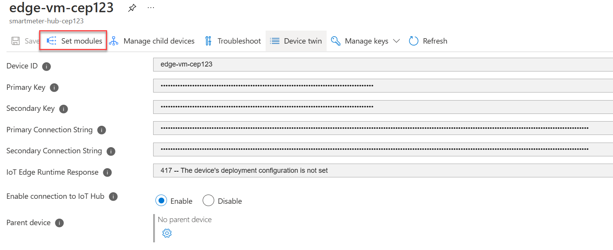

4. On the **Set modules on device: edge-vm-{SUFFIX}** screen, select the **Routes** tab and establish the following route. Once complete, select **Review + Create**, then **Create** on the review screen.

   | Route Name | Route Value | Description |
   |------------|-------------|-------------|
   | allDownstreamToIoTHub |FROM /messages/* WHERE NOT IS_DEFINED ($connectionModuleId) INTO $upstream | When a message is received from a downstream device, the $connectionModuleId value is blank. The $connectionModuleId value is only set on messages originating from other IoT Edge modules. This route value filters all messages and forwards on those originating from downstream devices. |

    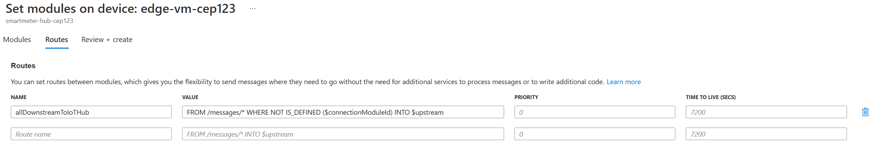

5. Wait a few moments and refresh the **edge-vm-{SUFFIX}** screen. Note that the IoT Edge Runtime Response now displays **200 -- OK** and the $edgeHub module is now running (you may need to refresh a few times to see the $edgeHub module running successfully).

    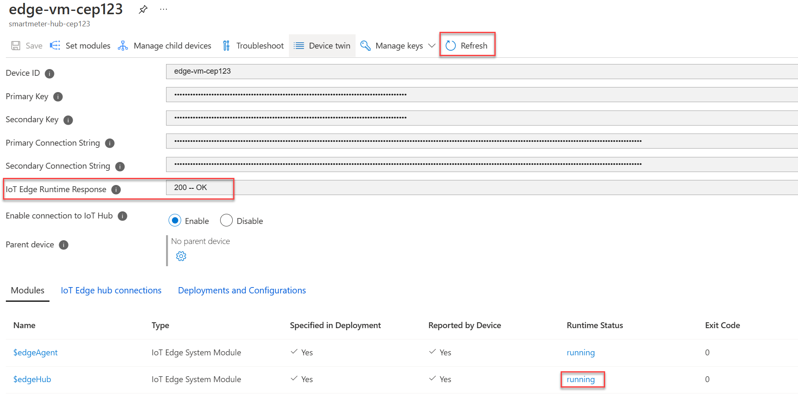

### Task 5: Update the device client to communicate through the IoT Edge Gateway

Individual downstream device clients need to be configured to communicate directly through the IoT Edge Gateway device rather than to the IoT Hub directly. In this task, the meters located in the second (right) building of the simulator will be configured to send telemetry through the IoT Edge transparent gateway. These are Devices 7, 8, and 9.

1. In the Azure Portal, open the lab resource group and locate and select the **smartmeter-hub-{SUFFIX}** IoT Hub.

2. From the left menu, select **IoT devices**.

3. From the list of IoT devices, select **Device7**.

   

4. Assign **edge-vm-{SUFFIX}** as the parent device. This will allow this device to communicate through the IoT Edge transparent gateway. Select the cog icon next to the **Parent device** field.

    

5. On the **Set an IoT Edge device as parent device** screen, select **edge-vm-{SUFFIX}** from the listing, then select **OK**.

    

6. Select **Save** on the IoT Device screen to commit the changes.

    

7. Repeat steps 1-6 for **Device8** and **Device9**.

8. In Visual Studio, open the **Sensor.cs** file from within the SmartMeterSimulator.

9. Locate the line **//TODO: 6. Connect the Device to Iot Hub by creating an instance of DeviceClient** and add the gateway hostname as the second parameter. This parameter will route all messages to the IoT Edge Gateway.

    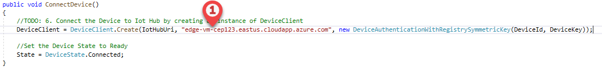

10. Locate **//TODO: 12 - Install and trust IoT Edge Gateway root certificate** in the DeviceManager.cs file and replace it with the following listing. This code will trust the root certificate of the IoT Edge gateway device. Replace {CERTPATH} with the full path to the certificate you downloaded from the cloud shell earlier. This method is called every time the application is run (MainForm.cs in the MainForm constructor).

    ```C#
    //TODO: 12 - Install and trust IoT Edge Gateway root certificate
    string trustedCACertPath = @"{CERTPATH}";
    if (!string.IsNullOrWhiteSpace(trustedCACertPath))
    {
        if (!File.Exists(trustedCACertPath))
        {
            // cannot proceed further without a proper cert file                    
            throw new InvalidOperationException("Invalid certificate file.");
        }
        else
        {
            X509Store store = new X509Store(StoreName.Root, StoreLocation.CurrentUser);
            store.Open(OpenFlags.ReadWrite);
            store.Add(new X509Certificate2(X509Certificate.CreateFromCertFile(trustedCACertPath)));
            store.Close();
        }
    }
    ```

11. Run the application, select all three windows in the second building (on the right in the simulator) and choose **Register**. Once the windows display as cyan, select the **Connect** button for the devices to start sending telemetry through the IoT Edge Gateway.

    

    >**Note**: You may be prompted to install the IoT Edge Gateway certificate, select **Yes** if this occurs.

    

12. Now it's time to verify telemetry is being sent to IoT Hub. In Visual Studio, expand the **View** menu and choose **Cloud Explorer**.

13. Expand the subscription being used for this lab, and expand the **IoT Hubs** node. Right-click on **smartmeter-hub-{SUFFIX}** to display the context menu and select the **Start Monitoring Built-in Event Endpoint** item.

    

14. The **Output** panel will start displaying IoT Hub events including telemetry events.

    

## After the hands-on lab

Duration: 10 mins

In this exercise, you will delete any Azure resources that were created in support of the lab. You should follow all steps provided after attending the Hands-on lab to ensure your account does not continue to be charged for lab resources.

### Task 1: Delete the resource group

1. Using the [Azure portal](https://portal.azure.com), navigate to the Resource group you used throughout this hands-on lab by selecting Resource groups in the left menu.

2. Search for the name of your research group and select it from the list.

3. Select Delete in the command bar and confirm the deletion by re-typing the Resource group name, and selecting Delete.

You should follow all steps provided _after_ attending the Hands-on lab.
